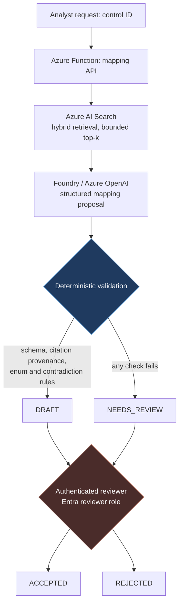

# Azure Security Evidence Assistant

A governed retrieval-augmented system that maps synthetic security evidence to a small NIST SP 800-53 Rev. 5 control subset.

> **The AI drafts and cites. Only a human accepts. Code enforces the difference.**

Security evidence review is a useful place for AI assistance and a poor place for AI authority. This repository demonstrates that separation as an enforced architectural boundary rather than as prompt wording.

## What the system does

A control is submitted for analysis. Azure AI Search retrieves evidence chunks from a synthetic corpus. A model hosted through Microsoft Foundry / Azure OpenAI proposes a structured mapping with citations, gaps, and a bounded coverage state. Deterministic code then validates that output against the retrieval set that produced it. The result is persisted as `DRAFT` or `NEEDS_REVIEW`. Only an authenticated Entra reviewer can move a mapping to `ACCEPTED` or `REJECTED`.



The two shaded nodes are the boundaries that carry the design. Everything upstream of them is advisory.

## Security invariants

These hold regardless of model behavior:

| Invariant | Enforced by |
|---|---|
| A model response cannot directly create `ACCEPTED` | Workflow state machine; the mapping code path has no transition to it |
| A fabricated citation cannot survive validation | Every cited `chunk_id` must exist **and** must have appeared in that request's retrieval set |
| `COVERED` / `PARTIAL` cannot survive without valid citations | Deterministic contradiction rule downgrades or rejects |
| Acceptance requires an authorized human | Separate review endpoint behind Entra RBAC; actor, timestamp, prior state, new state, and comment are recorded |
| Model output is never executed as instructions | Retrieved evidence is delimited and labeled as data; no tool authority is exposed to the model |
| Raw evidence never reaches normal telemetry | Telemetry allowlist of IDs, hashes, counts, and durations |

Prompt injection is treated as an expected failure mode of RAG systems rather than something a well-written prompt solves. Any sanitation pass is a tripwire, not a boundary. See [docs/THREAT_MODEL.md](docs/THREAT_MODEL.md).

## Identity and cost posture

Managed Identity handles service-to-service access, Entra RBAC handles reviewer authorization, and GitHub Actions OIDC handles deployment. Key Vault holds only residual secrets that identity-based access cannot eliminate, and may be nearly empty by design.

The repository is the durable asset; the Azure runtime is disposable. Infrastructure is declared in Terraform, deployed when work or a demonstration requires it, then destroyed. Target total spend is no more than $15 USD, with cost alerts at $5 / $10 / $15 and teardown as the actual control — Azure budgets notify rather than enforce.

```text
terraform apply → seed evidence → run / test / demo → capture results → terraform destroy
```

## Data

All evidence in this repository is synthetic and exists only to demonstrate architecture, retrieval, validation, and human-review patterns. The project is not trained or evaluated on customer security data, and its evaluation results should not be interpreted as production compliance performance.

The v1 corpus is five controls and eight synthetic evidence documents, deliberately sized to produce supported, partial, missing, contradictory, and adversarial cases without becoming a compliance content project. Control identifiers and titles come from NIST SP 800-53 Rev. 5, a U.S. Government work; requirement summaries are original wording. See [docs/DATA_STATEMENT.md](docs/DATA_STATEMENT.md).

## Evaluation

Results are published as numbers rather than adjectives. The metrics that matter most are false-coverage rate and missing-evidence recall, not aggregate accuracy. Post-validation citation validity is 100% by construction; the informative figure is how often the guardrail had to reject model output.

Results table: [docs/EVALUATION_PLAN.md](docs/EVALUATION_PLAN.md) — populated at M4.

## Scope boundary

Deliberately not built: questionnaire engine, evidence-pack generation, customer onboarding, multi-tenant architecture, proprietary compliance scoring, auditor portals, a large control library, or a production customer data model. The repository demonstrates an architecture pattern; productization is a separate exercise.

Deferred with reasons recorded: Durable Functions ([ADR-002](docs/adr/ADR-002-durable-functions-deferred.md)), Logic Apps, Blob Storage ingestion. Agent frameworks are out of scope.

## Documentation

| Document | Contents |
|---|---|
| [DESIGN.md](docs/DESIGN.md) | v1 architecture, requirements, data model, validation chain, milestones |
| [THREAT_MODEL.md](docs/THREAT_MODEL.md) | STRIDE-lite model over five trust boundaries, 16 threat scenarios |
| [EVALUATION_PLAN.md](docs/EVALUATION_PLAN.md) | Golden and adversarial sets, metrics, acceptance criteria, cost protocol |
| [DATA_STATEMENT.md](docs/DATA_STATEMENT.md) | Synthetic-data policy, minimization, logging policy |
| [CONTROL_EVIDENCE_PLAN.md](docs/CONTROL_EVIDENCE_PLAN.md) | The five controls, eight evidence artifacts, adversarial variants |
| [MILESTONE_0_CHECKLIST.md](docs/MILESTONE_0_CHECKLIST.md) | Design-lock checklist and change-control rule |
| [adr/](docs/adr/) | Seven architecture decision records |
| [infra/README.md](infra/README.md) | One-time state-backend bootstrap, session workflow, and what is deliberately not committed |

## Repository layout

```text
├── docs/            design, threat model, evaluation plan, data statement, ADRs
├── infra/           Terraform configuration, modules, and bootstrap instructions
├── data/
│   ├── controls/    control catalog (JSON)
│   └── evidence/    synthetic evidence corpus — authoritative source
├── src/
│   ├── ingest/      chunking, embedding, index population
│   ├── mapping/     retrieval and structured proposal generation
│   ├── validation/  deterministic guardrails
│   ├── review/      authenticated reviewer transitions and audit records
│   └── shared/      common models and clients
├── evals/           golden set, adversarial set, published results
├── schemas/         versioned output schemas
├── prompts/         versioned prompts
├── tests/           unit and integration tests
└── .github/workflows/
```

## Status

| Milestone | State |
|---|---|
| M0 — Design lock | Complete |
| M1 — Infrastructure skeleton | Not started |
| M2 — Ingest and retrieval | Not started |
| M3 — Mapping and validation | Not started |
| M4 — Review and evaluation | Not started |
| M5 — Polish | Not started |

The first vertical slice is intentionally narrow: one control (IA-2(1)), two evidence files, one index, one mapping request, one validation path, one review transition — working end to end before the corpus is expanded.
