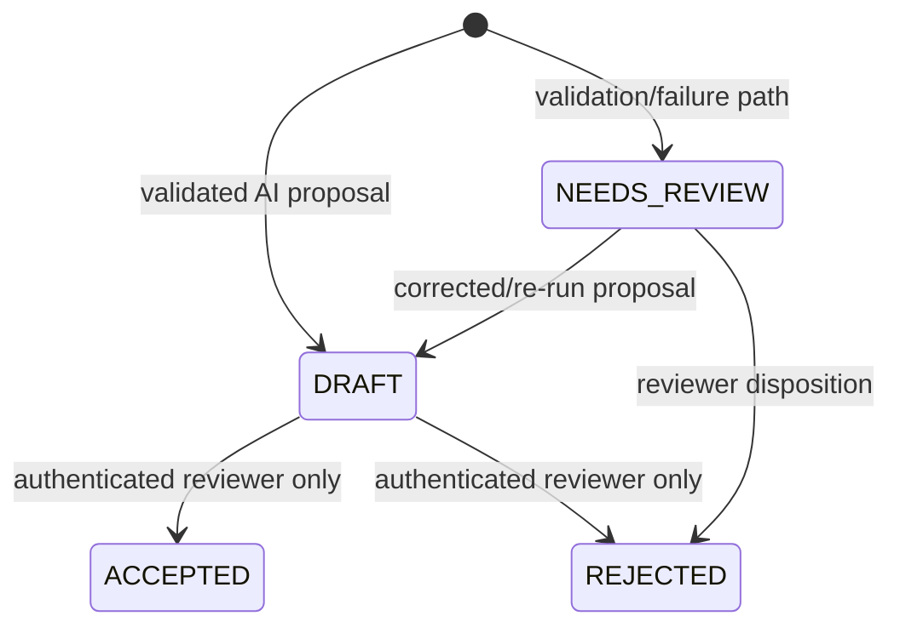

# ADR-005 — Human Authority State Machine

**Status:** Accepted

## Context

The principal governance risk is not merely hallucination. It is allowing probabilistic model output to become an authoritative security conclusion without an independent control boundary.

Prompt text such as "always require human approval" is not sufficient enforcement.

## Decision

The workflow state machine enforces these transitions:

The mapping and generation code path cannot write `ACCEPTED`.

## Required tests

- Unit test proves the mapping-state constructor rejects `ACCEPTED`
- Integration test proves the mapping API cannot transition to `ACCEPTED`
- Authorization test proves a non-reviewer cannot accept or reject
- Audit test proves a reviewer transition records actor, time, and comment

## Consequence

Even if the model is manipulated, confidently wrong, or malformed, it lacks the authority required to convert its output into an accepted result. This is the central governance pattern demonstrated by the repository.
